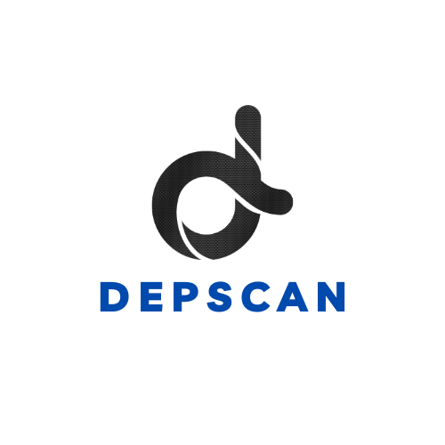

# depscan-bin

Repository containing the binaries for [depscan](https://github.com/owasp-dep-scan/dep-scan) - the dependency scanning tool. depscan is also available on [PyPI](https://pypi.org/project/appthreat-depscan/)

## Single binary executables

Download the executable binary for your operating system from the [releases page](https://github.com/appthreat/depscan-bin/releases). These binary bundle the following:

- dep-scan with Python 3.11
- cdxgen with Node.js 20
- cdxgen binary plugins

## Discord support

The developers could be reached via the [discord](https://discord.gg/DCNxzaeUpd) channel.
